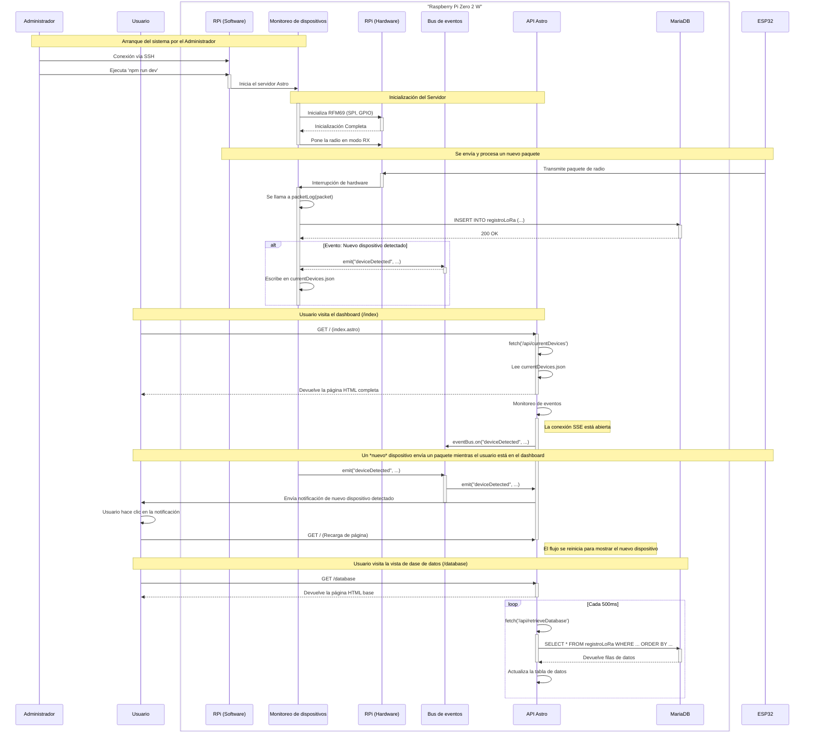

```mermaid
sequenceDiagram
    participant Administrador
    participant UsuarioBrowser as Usuario
    participant Terminal_RPi as RPi (Software)
    participant DM_Integration as Monitoreo de dispositivos
    participant RPi_HW as RPi (Hardware)
    participant EventBus as Bus de eventos
    participant API as API Astro
    participant MariaDB
    participant ESP32 as ESP32

    box "Raspberry Pi Zero 2 W"
        participant Terminal_RPi
        participant DM_Integration
        participant EventBus
        participant MariaDB
        participant API
        participant RPi_HW
    end

    %% ==================================
    %% Administrador: Arranque del Servidor
    %% ==================================
    Note over Administrador, DM_Integration: Arranque del sistema por el Administrador
    Administrador->>Terminal_RPi: Conexión vía SSH
    Administrador->>Terminal_RPi: Ejecuta 'npm run dev'
    activate Terminal_RPi
    Terminal_RPi->>DM_Integration: Inicia el servidor Astro
    deactivate Terminal_RPi

    %% =============================
    %% Flujo de Inicialización del Servidor
    %% =============================
    Note over DM_Integration, API: Inicialización del Servidor
    activate DM_Integration
    DM_Integration->>RPi_HW: Inicializa RFM69 (SPI, GPIO)
    activate RPi_HW
    RPi_HW-->>DM_Integration: Inicialización Completa
    deactivate RPi_HW
    DM_Integration->>RPi_HW: Pone la radio en modo RX
    deactivate DM_Integration

    %% =============================
    %% Flujo de Recepción de Paquetes
    %% =============================
    Note over ESP32, Terminal_RPi: Se envía y procesa un nuevo paquete
    ESP32->>RPi_HW: Transmite paquete de radio
    activate RPi_HW
    RPi_HW->>DM_Integration: Interrupción de hardware
    deactivate RPi_HW
    activate DM_Integration
    DM_Integration->>DM_Integration: Se llama a packetLog(packet)
    DM_Integration->>MariaDB: INSERT INTO registroLoRa (...)
    activate MariaDB
    MariaDB-->>DM_Integration: 200 OK
    deactivate MariaDB
    
    alt Evento: Nuevo dispositivo detectado
        DM_Integration->>EventBus: emit("deviceDetected", ...)
        activate EventBus
        EventBus-->>DM_Integration: 
        deactivate EventBus
        DM_Integration->>DM_Integration: Escribe en currentDevices.json
    end
    deactivate DM_Integration

    %% =====================================
    %% Flujo de la Página del Dashboard (/)
    %% =====================================
    Note over UsuarioBrowser, API: Usuario visita el dashboard (/index)
    UsuarioBrowser->>API: GET / (index.astro)
    activate API
    API->>API: fetch('/api/currentDevices')
    API->>API: Lee currentDevices.json
    API-->>UsuarioBrowser: Devuelve la página HTML completa
    deactivate API

    API->>API: Monitoreo de eventos
    activate API
    Note right of API: La conexión SSE está abierta
    API->>EventBus: eventBus.on("deviceDetected", ...)
    
    %% ========================================
    %% Flujo de Notificación de Nuevo Dispositivo (SSE)
    %% ========================================
    Note over ESP32, UsuarioBrowser: Un *nuevo* dispositivo envía un paquete mientras el usuario está en el dashboard
    DM_Integration->>EventBus: emit("deviceDetected", ...)
    activate EventBus
    EventBus->>API: emit("deviceDetected", ...)
    API->>UsuarioBrowser: Envía notificación de nuevo dispositivo detectado
    deactivate EventBus
    
    UsuarioBrowser->>UsuarioBrowser: Usuario hace clic en la notificación
    UsuarioBrowser->>API: GET / (Recarga de página)
    deactivate API
    Note right of API: El flujo se reinicia para mostrar el nuevo dispositivo
    
    %% =========================================
    %% Flujo de la Página de Base de Datos (/database)
    %% =========================================
    Note over UsuarioBrowser, MariaDB: Usuario visita la vista de dase de datos (/database)
    UsuarioBrowser->>API: GET /database
    activate API
    API-->>UsuarioBrowser: Devuelve la página HTML base
    deactivate API

    loop Cada 500ms
        API->>API: fetch('/api/retrieveDatabase')
        activate API
        API->>MariaDB: SELECT * FROM registroLoRa WHERE ... ORDER BY ...
        activate MariaDB
        MariaDB-->>API: Devuelve filas de datos
        deactivate MariaDB
        deactivate API
        API->>API: Actualiza la tabla de datos
    end
```